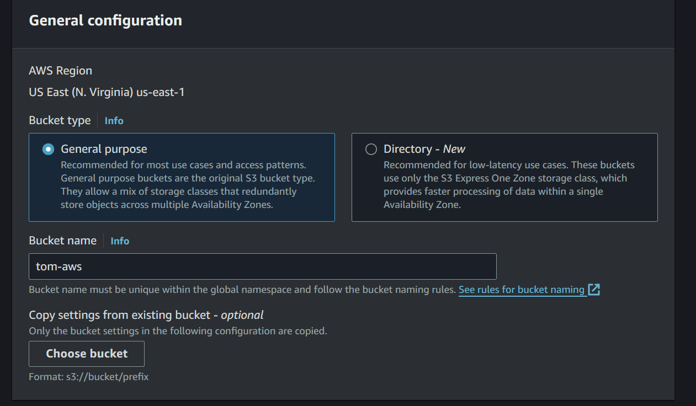

# Hosting a static website with S3 using Cloudfront

1. navigate to S3 on amazon and click on `create bucket`
2. name you bucket on general configuration section



3. scroll to Block Public Access settings for this bucket section, untick **Block *all* public access** and acknowledge

   
4. click on create bucket to create 'tom-aws bucket'

   

   
5. Bucket has been created. Click on `tom-aws` and upload 


6. Add the web content and upload

   

   
7. After uploading, click on properties on the `tom-aws` section of the S3, scroll down to static web hosting and click on edit.
8. Click on enable, and fill in the index document box as index.html, save changes

   
9. Add a bucket policy by clicking on permission, scroll to bucket policy section, edit and fill in below and save changes.

   ```
   {
       "Version": "2012-10-17",
       "Statement": [
           {
               "Sid": "PublicReadGetObject",
               "Effect": "Allow",
               "Principal": "*",
               "Action": "s3:GetObject",
               "Resource": "arn:aws:s3:::tom-aws/*"
           }
       ]
   }
   ```
10. Return to properties, scroll down to static web hosting to get the url.

    


*****Stopped here as my aws account is limited from cloudfront resources atm.*****
